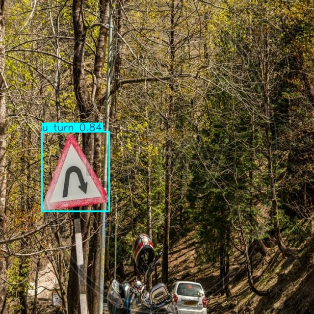

# Traffic Sign Detection with YOLO

### Author: Virendrasinh Chavda

This repository contains a deep learning-based project for detecting and recognizing traffic signs using the YOLO object detection framework. The project is designed to assist in applications like autonomous driving and traffic monitoring by accurately identifying traffic signs in real-time from images or video streams.

---

## Table of Contents
1. [Overview](#overview)
2. [Installation](#installation)
3. [Data](#data)
4. [Features](#features)
5. [Visualizations](#visualizations)
6. [Methodology](#methodology)
7. [Results](#results)
8. [Future Work](#future-work)
9. [Contributing](#contributing)
10. [License](#license)

---

## Overview

Accurately detecting traffic signs is crucial for the development of intelligent transportation systems. This project uses the YOLO (You Only Look Once) algorithm for real-time detection and classification of various traffic signs. The trained model is capable of identifying signs such as "U-turn", "Side Road Left", and "Unguarded Level Crossing" with high confidence.

The model is trained on a labeled dataset of traffic sign images and achieves robust detection performance across various scenarios, including complex backgrounds and different lighting conditions.

---

## Installation

To set up the project, clone the repository and install the required dependencies listed in the `requirements.txt` file. Run the Jupyter Notebook `training.ipynb` to train or evaluate the YOLO model. The pre-trained model weights (`yolo11n.pt`) can also be used for inference.

---

## Data

The dataset contains annotated images of various traffic signs. Each image is labeled with the class of the sign and its bounding box coordinates. Key features of the dataset include:

- **Traffic Sign Classes**: Examples include "U-turn", "Side Road Left", and "Unguarded Level Crossing".
- **Bounding Boxes**: Provide the location and size of traffic signs in each image.

The dataset was preprocessed to ensure consistency in image dimensions and annotation format.

---

## Features

### YOLO Model
- Utilizes the YOLO framework for efficient real-time object detection.
- Capable of detecting multiple classes of traffic signs in a single image.

### Visualizations
- **Detection Results**: Includes bounding boxes and class labels for detected signs.
- **Confidence Scores**: Displays the model's confidence in its predictions.

### Pre-trained Weights
- Includes a pre-trained model (`yolo11n.pt`) for quick inference without retraining.

---

## Visualizations

The following images showcase the model's ability to detect and classify traffic signs:

#### Example 1: U-turn Sign
- The model successfully detects a "U-turn" sign with a confidence score of 0.84.

  

#### Example 2: Side Road Left
- The model identifies a "Side Road Left" sign with a confidence score of 0.75.

  

#### Example 3: Unguarded Level Crossing
- The model detects an "Unguarded Level Crossing" sign with a confidence score of 0.92.

  

These visualizations demonstrate the robustness of the trained YOLO model in real-world scenarios.

---

## Methodology

1. **Data Preparation**:
   - Collected and annotated a diverse set of traffic sign images.
   - Preprocessed images to match the input requirements of the YOLO model.

2. **Model Training**:
   - Trained the YOLO model using the annotated dataset.
   - Used data augmentation techniques to improve model generalization.

3. **Evaluation**:
   - Assessed the model's performance on a separate validation set.
   - Visualized detection results using bounding boxes and class labels.

---

## Results

The model demonstrates high accuracy in detecting traffic signs across various conditions. Key performance metrics include:

- **Precision**: Measures the proportion of correctly identified traffic signs.
- **Recall**: Measures the model's ability to detect all relevant traffic signs.
- **Confidence Scores**: High confidence values (e.g., 0.84, 0.75, 0.92) indicate reliable predictions.

The visualizations above further illustrate the model's effectiveness in real-world scenarios.

---

## Future Work

1. **Model Enhancement**:
   - Train the YOLO model on a larger and more diverse dataset.
   - Experiment with advanced YOLO versions for improved performance.

2. **Deployment**:
   - Integrate the model into a real-time video processing pipeline for autonomous driving systems.

3. **Additional Classes**:
   - Expand the dataset to include more traffic sign categories.

---

## Contributing

Contributions are welcome! Feel free to fork the repository, make improvements, and submit a pull request. If you encounter any issues, please open a GitHub issue for discussion.

---

## License

This project is licensed under the MIT License. See the [LICENSE](./LICENSE) file for more details.
